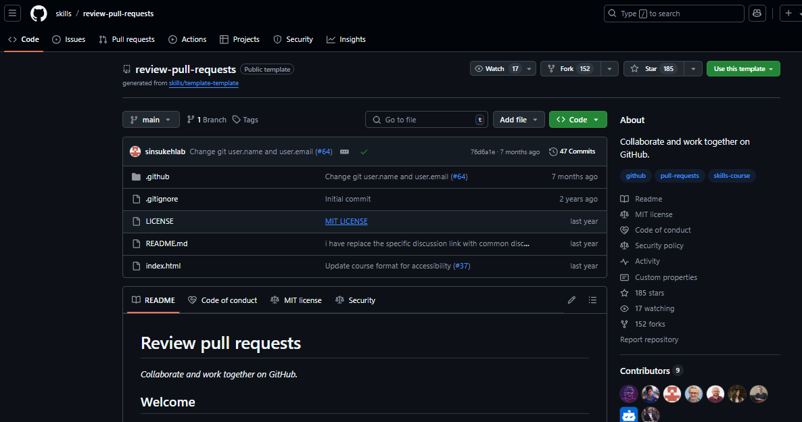
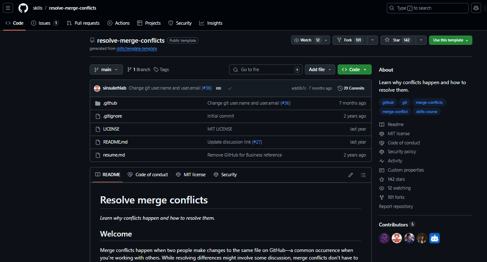

# Week #1 Post-activity RECAP
Review Pull Requests and Merge Conflict in GitHub

---

# Definition of a Pull Request

  

      A pull request is a way to propose code changes, allowing for review before merging into the main branch.
  

  

  

    <b class="text-red-400">Collaboration</b> happens on a pull request. The pull request shows the changes in your branch to other people. This pull request is going to keep the changes you just made on your branch and propose applying them to the main branch.  <i>-GitHub README</i>
  

---

# Pull Request Review

  

    Reviewing a pull request is an opportunity to examine another contributor's changes and give them feedback. It's an awesome opportunity to learn more about how the project works and how others solve problems.  <i>-GitHub README</i>
  

---

# Pull Request Process (Simulate)

  

---

# Resolve merge conflicts (Simulate)

  

  

---

  <h1 style="font-size: 8rem; color: #4CAF50;;">
        Thank You
    </h1>
    <h2 style="font-size: 4rem; color: #4CAF50;">
        Any questions?
    </h2>

